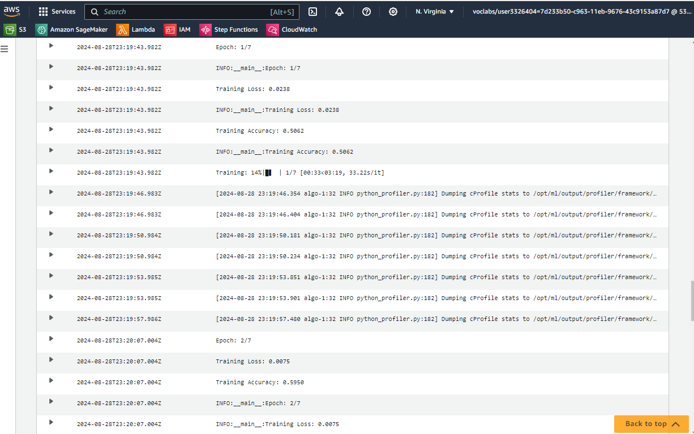

# Image Classification using AWS SageMaker

This repo contains the code and data to develop an image classifier using AWS Sagemaker profiling, debugger, hyperparameter tuning and other good ML engineering practices. This project is part of Udacity's AWS Machine Learning Engineer nanodegree program.

## Project Set Up and Installation
1. Create a JupyterLab space in SageMaker Studio and clone the repo.
2. Employed data in this project is inside the 'data' dir, however you can download the full data [here](https://www.kaggle.com/competitions/isic-2024-challenge/data) if you wish to upscale the model.
3. Open the [train_and_deploy](https://github.com/DannyLCG/ImageClassificationUsingAmazonSageMaler/blob/main/train_and_deploy.ipynb) notebook to perform HPO, and Profiling/Debugging of an optmized model. Feel free to explore on bigger hyperparameter spaces in the Hyperparameter tuning section.
4. A test file is provided in HDF5 format 'test-image' however, loading and predicting from a JPG image is also possible (example code provided in the Model Deploying section).

**NOTE:** Things to have in mind if you wish to upscale this project:

- The images in this dataset are of size 380x380, ResNet was trained using 240x240 images.
- The JPG images can also be used (here we extracted image data from  HDF5 files) but I don't consider convenient to upload thousand of images to S3.
- Look after your instance type for deploying, insuficient instances may present long runtimes due to lack of computation resources and stall inference. You can also consider implementing autoscaling.
    

## Dataset
The data comes from the Kaggle competition **ISIC 2024 - Skin Cancer Detection with 3D-TBP**.
The original dataset consists of 401,059 images for training and a test set containing only 3 images since the complete testing data is intended to be provided after the competition is finished. However, to avoid large training times and save on SageMaker's runtime we take a sample from the original data: Our complete dataset consists on only 1,000 images stratified by target so the label proportion is kept. For a more thorough description of the data and download visit [here](https://www.kaggle.com/competitions/isic-2024-challenge/overview).

### Access
Upload the data to your own dedicated S3 bucket so that SageMaker has access to the data. 

## Hyperparameter Tuning
I chose to use ResNet50 as it is a widely spread model in CV tasks and can be easily implemented from the PyTorch library.

I used SageMaker hyperparamter tuner to tune this hyperparameters:
- Batch size: this parameter can improve in training time and resource utilization such as efficient GPU utilization during training, validation and even testing.
- Epochs: we won't try a large range of epochs since we are finetuning a pretrained model. Additionally we save on runtime usage.
- Learning rate: probably one of the most unpredictable hyperparameters, but a good value to start is around 1e-2.

The explored hyperparameter spaces are:
- Learning rate: (0.001-0.1)
- Batch size: (64, 128)
- Epochs: (5, 10)


## Debugging and Profiling
We trained our model with the best hyperparameters from the last HPO training jobs and added hooks to log performance and system usage. 

Used hyperparameters for training:
- Batch size: 128
- Epochs: 7
- Learning rate: 0.01

Concepts
- Debug Hook: Hook is the construct with which Amazon SageMaker Debugger looks into the training process and captures the tensors requested at the desired step intervals
- Rule: A logical construct, implemented as Python code, which helps analyze the tensors captured by the hook and report anomalies if any.

We used a few of the most abvipus rules, like 'loss_not_decreasing', 'vanishing_gradient', 'overfit', and 'overtraining' to monitor the general performance of our model and debug when encountering any issues that may lead to underfitting or poor model generalization. Also, we used the 'LowGPUUtilization' rule to trigger a flag if the GPU is not being used efficiently.

```python
from sagemaker.debugger import Rule, ProfilerRule, rule_configs

# Create debugging and profiling rules
rules = [
    Rule.sagemaker(rule_configs.loss_not_decreasing()),
    Rule.sagemaker(rule_configs.vanishing_gradient()),
    Rule.sagemaker(rule_configs.overfit()),
    Rule.sagemaker(rule_configs.overtraining()),
    ProfilerRule.sagemaker(rule_configs.LowGPUUtilization()),
    ProfilerRule.sagemaker(rule_configs.ProfilerReport()), 
]
```


### Results

As we can see, the training loss and accuracy were successfully logged and can be visualized in CloudWatch...


GPU utilization analysis:

The implemented rules implemented by our debugger were not triggered but one:  'LowGPUUtilization' which checks for low and fluctuating GPU usage. According to the generated Profiler report, our mode is underutilizing the instance and we are advised to change it into a smaller instance type or increase the batch size. It is worth noticing that our HPO jobs favored the usage of the biggest batch size, so this is probably the way to go to address this issue.

Here are some of the plots obtained from the profiling data that confirms the triggering of the rule.


## Model Deployment

We can directly deploy the model from the estimator, but if we want to make further development without mantaining an active endpoint (and generate costs) we can create a Model object from the model artifact a separate inferene script to use as entry point, ours is located at [inference](https://github.com/DannyLCG/ImageClassificationUsingAmazonSageMaler/blob/main/scripts/inference.py).

After deploying the model, we can query the endpoint with a sample image coming from a HDF5 file (code example to query with a JPG provided in the [notebook](https://github.com/DannyLCG/ImageClassificationUsingAmazonSageMaler/blob/main/train_and_deploy.ipynb)):

<details>
  <summary> Click here to see the example </summary>

```python
import io

import h5py
import numpy as np
from PIL import Image
from torchvision import transforms
import matplotlib.pyplot as plt

test_file = "data/isic-2024-challenge/test-image.hdf5"

def read_images(file_path):
    '''Function to read image data from a HDF5 file.
    Params:
        file_path: str, the file path to the HDF5 file.
        
    return: dict, a dictionary in the form of {Image ID: numpy array}"'''
    with h5py.File(file_path, 'r') as file:
        ids_list = list(file.keys())
        images = {}
        for img_id in tqdm(ids_list):
            # Extract the image data
            image_data = file[img_id][()] #retrieve the entire data from each dataset
            image = Image.open(io.BytesIO(image_data))
            images[img_id] = np.array(image)

    return images

test_images = read_images(test_file)

test_img_id, test_img_array = next(iter(test_images.items()))

# Convert np array to image
image = Image.fromarray(test_img_array)

#Create needed data transformations
# Pretrained params used for efficientNet_b4 during pretraining
pretrained_size = 380
mean = [0.485, 0.456, 0.406]
std = [0.229, 0.224, 0.225]

transformation = transforms.Compose([
    transforms.Resize(pretrained_size),
    transforms.ToTensor(),
    transforms.Normalize(mean, std)
])

tensor_image = transformation(image)
tensor_image_large = tensor_image.unsqueeze(0) #shape must now be (1, 3 , 380, 380)
# Predict
response = predictor.predict(data=tensor_image_large)
predicted_label = np.argmax(response, 1)[0]

print(f"Predicted label for our test image: {predicted_label}")

# Plot the image
plt.figure()
plt.imshow(test_img_array)
plt.title(f"Image ID: {test_img_id}")
plt.axis('off')
plt.show()

```

</details>

## Standout Suggestions

- Package Your Model: Can you package your model as a Docker Container(opens in a new tab) so that it can be easily deployed. Or try creating an app using StreamLit apps.
- Create a batch transform job to perform inference from JPG images.
- Use Amazon Sagemaker Clarity(opens in a new tab) to make your models more interpretable

---
## Dataset citation
International Skin Imaging Collaboration. SLICE-3D 2024 Challenge Dataset. International Skin Imaging Collaboration https://doi.org/10.34970/2024-slice-3d (2024).

Creative Commons Attribution-Non Commercial 4.0 International License.

The dataset was generated by the International Skin Imaging Collaboration (ISIC) and images are from the following sources: Hospital Clínic de Barcelona, Memorial Sloan Kettering Cancer Center, Hospital of Basel, FNQH Cairns, The University of Queensland, Melanoma Institute Australia, Monash University and Alfred Health, University of Athens Medical School, and Medical University of Vienna.